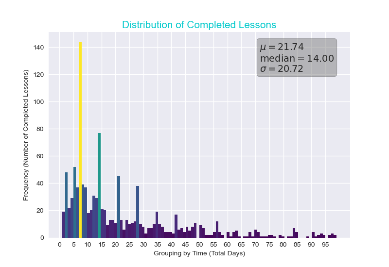

## Overview 

The script file `StudentDataVis.py` contains a collection of functions, used to analyze and visualize the data generated by the Student Object Serializer. This page is divided into two categories, statistical functions, which documents all mathematical functions available, and visualization functions, which documents all functions that produce visuals based off data input.  

## Statistical Functions 

##### `calc_avg(set: list)` returns  `float`
Returns the average (arithmetic mean) of a set real numbers.  

##### `variance(set: list)` returns  `float` 
Returns the variance of a set of real numbers, used in the calculation of the standard deviation. 

##### `standard_deviation(set: list)` returns `float` 
Returns the standard deviation of a set of real numbers.  

##### `gauss(u: float, sigma: float, x: float)` returns `float`
Returns a value contained within the gaussian distribution (normal distribution) of a set. 

**Parameters**
 - `u: float` the mean of a set. 

 - `sigma: float` the standard deviation of a set. 

 - `x: float` an element contained within the set. 

     **Note**: `u`, `sigma`, and `x` must all come from the same set of real numbers in order to meaningfully model any distribution.  

##### `strip_outliers(range_to_check: list, max_element=None, min_element=None)` returns `list`
Returns a list , where all values outside the minimum and maximum range, specified by the parameters `min_element` and `max_element`, have been removed. To exclusively remove elements above or below a set value, leave the other parameter empty.   

**Pararmeters** 
- `range_to_check: list`, a list of values that where all vlaues outside the restricted range will be removed. 
- `max_element: int`, an int that sets the upper bound of the range. 
- `max_element: int`, an int that sets the lower bound of the range. 

**Note:** `range_to_check` can be unordered, since the function checks outliers by value, and not by index.

**Example:**  

```python 
a = [3,1,2,0]
stripped_a = strip_outliers(a, 2) 
print(stripped_a)
>>> [1,2,0]
```

## Visualization Functions 

##### `generate_report_card(key: str, student_dict: dict, **kwargs)  ` returns  `None`   
Generates a student report card (an image), containing performance metrics, and plots related to the given student's progress through the curriculum.  

**Parameters:** 
- `key: str`, a string key that matches a students name found in the corresponding `student_dict` dictionary.   
- `student_dict: dict`, a dictionary comprised of  `{key: str, value: object}` where the object is a student object generated by `StudentObjectSerializer.py`. 

**keyword arguments:**  
- `show_covid: bool` , displays a line on plot 2, indicating the start of the COVID-19 quarantine in the state of Washington.   
- `save_fig: bool` , saves the figure as a png to the same directory as the script file. 

**Example output:** 
Given the following function call, and a valid dictionary of student objects.

```python
generate_report_card("Romesh Mamidi", student_obj_dict, save_fig=True, show_covid=True)
```

The function produces the following report card.

 

​	**Key Report Card Components:** 

1.  Completion rate metrics for lessons and ranks.
2.  Longest time spent on a lesson and rank.  
3.  Plot shows rank completion rate over date of completion.  
4.  Plot shows rank lesson rate over date of completion, blue dashed line and label indicate COVID-19 lock down date.  
5.  Plot shows total time spent at each rank, ordered by rank. 


##### ` generate_lesson_timeline(student_dict, **kwargs)` returns  `None` 
Generates a plot, showing the total number of lessons completed each day from 2018 to the last time the dataset was generated.

**Parameters:**    
- `student_dict`, a dictionary comprised of  `{key: str, value: object}` where the object is a student object generated by `StudentObjectSerializer.py`. Referred to as a  valid student dictionary for the rest of this page.   

**keyword arguments:**  
 - `monthly_rate: bool` , changes the output scale from daily to monthly.    
 - `save_fig: bool` , saves the figure as a png to the same directory as the script file. 


##### `generate_total_lesson_distribution(student_dict, **kwargs)` returns  `list` 
Iterates through all `student.lesson_completion_times`   compiling and returning all lesson completion times as a single list.  This list is used to generate a histogram of all lesson completion times.  

**Parameters:**    
- `student_dict`, a  valid student dictionary.   

**keyword arguments:**  
 - `max_outlier: float` , pass in a value to restrict the range to be strictly less than this value. For example passing 100, would cap the the maximum value of the distribution at 99.       
 - `min_outlier: float` , pass in a value to restrict the range to be strictly greater than this value. 


##### `plot_color_histogram(range_to_color: list, number_of_bins: int, *save_fig: bool, **kwargs)` returns  `None` 
Generates a color gradient defined histogram, based of the passed in data. Where the color of a given bin is determined by the frequency at that point.  

**Parameters:**    
  - `range_to_color: list`,  a list of values. In the case of this project, this list is often a collation of rates or times. For example the output from `generate_total_lesson_distribution(student_dict, **kwargs)`  is valid to pass in.
  - `number_of_bins: int` sets the amount of bins in the histogram. 

**Optional arguments**
- `save_fig: bool` , saves the figure as a png to the same directory as the script file. 

**keyword arguments:**  
 - `fig_title: str` , pass in a string to change the title of the plot.       
 - `show_stats: bool` , adds a textbox containing the mean, standard deviation and median of the data to the upper right hand side plot. 

**Example output:** 
Given the following function call, and a valid dictionary of student objects.

```python
all_lessons = generate_total_lesson_distribution(student_obj_dict, max_outlier=100, min_outlier=0)
plot_color_histogram(all_lessons, 100, True, show_stats=True)
```

The function produces the following plot. 



##### `generate_ranges_per_rank(student_dict: dict)` returns  `dict`  
Returns a dictionary of all lessons completion times indexed by rank, where `{key: int, value: list}`. 

**Parameters:**  
- `student_dict: dict`, a  valid student dictionary. 


##### `generate_rank_histogram(rank: str, student_dict: dict, **kwargs)` returns  `None` 
Generates a color gradient defined histogram, based of the passed in lesson completion data; however, this histogram is restricted to a specific rank of the curriculum (a subset of all completed lessons).  

**Parameters:**    
  - `rank: str` , a string corresponding a rank in the curriculum, ie '`'defender'`. 
  - `student_dict: dict`, a  valid student dictionary.   

**keyword arguments:**  
 - `save_fig: bool` , saves the figure as a png to the same directory as the script file. 
 - `fig_title: str` , pass in a string to change the title of the plot.       
 - `show_stats: bool` , adds a textbox containing the mean, standard deviation and median of the data to the upper right hand side plot.  
 - `max_outlier: float` , pass in a value to restrict the range to be strictly less than this value.       
 - `min_outlier: float` , pass in a value to restrict the range to be strictly greater than this value. 

## Documentation Links
- [Student Object Serializer Documentation](https://mjsmith95.github.io/MCDataVis/SOS) 
- [Understanding the Data, Metrics, and Analysis Procedures](https://mjsmith95.github.io/MCDataVis/MCDV) 
- [Back to main page](https://mjsmith95.github.io/MCDataVis)   
