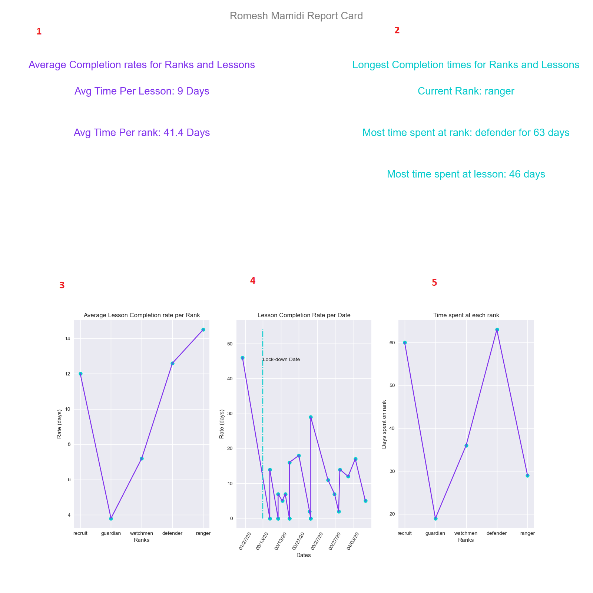
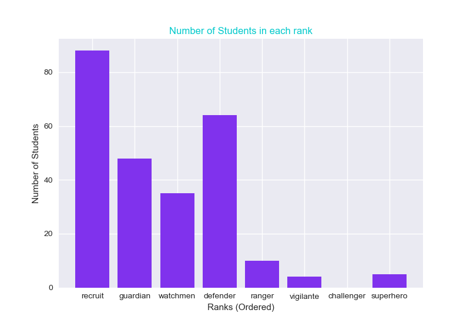
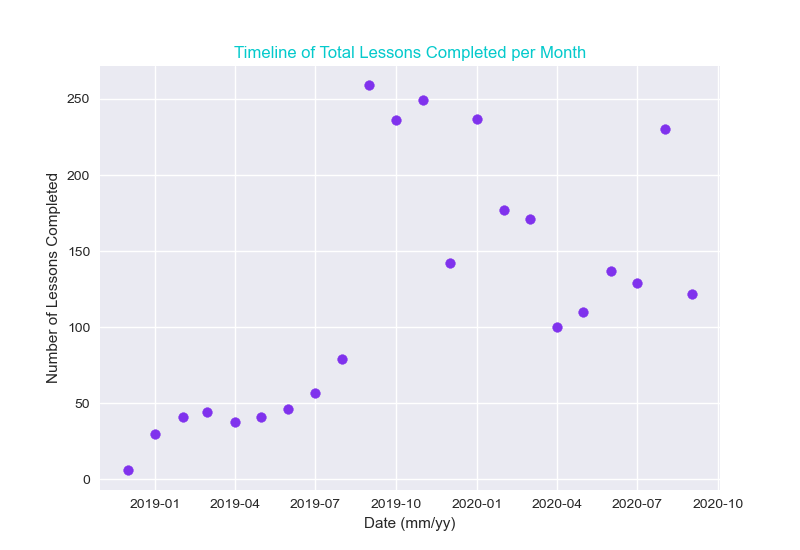
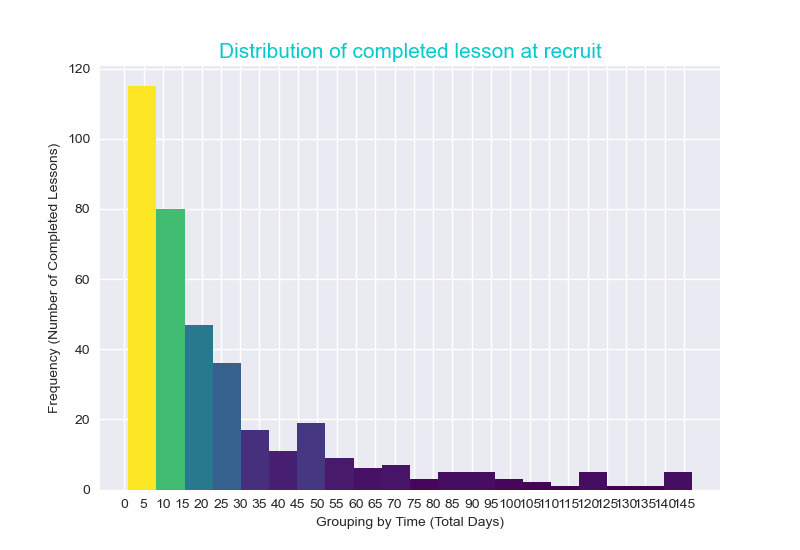

## Understanding the Data,Metrics, and Analysis Procedures

This section provides examples and and insight into the metrics and analysis being performed using the tools created in this project. 

## Metrics

**Lesson Completion Time** 

Lesson completion time is defined as the time it takes a student to move from one lesson to the next. The curriculum has a total of 40 lessons divided into sets of 5 organized by rank.  To calculate the total lesson time we take the start date of the current lesson subtracted by the previous lesson.  The metric shows the amount of time in days a student spends on a given lesson. This metric doesn't account for the fact that all students are on a weekly or bi-weekly schedule, meaning if a lesson took 14 days to complete, the student may have only had 2 - 4 sessions at mighty coders. Given that this error is systematic, and present across all data its save to assume that the trends are correct despite the magnitude.   

**Average Lesson Completion Time** 

By calculating the mean and median time it takes a student to complete a lesson per rank, we gain a better understanding of how hard that rank is and how much time a student spends there.   

**Rank** 

There are 8 ranks in the MightyCoders curriculum each rank is meant to be more challenging than the last. Each rank is comprised of 5 lessons. Ranks act to patrician our students into distinct groups, by grouping students on a per rank basis we can see how students perform in a give rank.   

## Plots 

#### Student Report Card

An example of a student report card generated from our tool set. Below the image is a breakdown and explanation of each section.  

1. This section contains two metrics, the mean time per lesson across all lessons the student has completed, and the mean time a student spends on lesson per rank.  

2. This section displays the current rank of the student, and the longest time spent on a rank and lesson. 

3. This plots shows the progress of average lesson completion time for each rank measured in days. 

4. This plot shows a time line of all lessons the student has completed over the dates they completed those lessons. The blue line and label indicates the start date of social distancing for COVID-19 in the state of Washington.  

5. This plots shows the total time spent at each rank measured in days. 

   This card is sent to parents and explained to provide them with a holistic overview of their child's progress.  

#### Rank Bar Chart

This bar chart outlines the total number of students present at each rank. The ranks are ordered by student progression.  

#### All Lessons Timeline 

This chart displays the total number of lessons completed per month. 

#### All Lessons Histogram  

This distribution represents the amount of lessons completed in sets of 5 days. This mean average for lesson completion is 21.7 days, and the median is 14. 

#### Restricted Rank Histogram

This histogram display the same information as above but restricted to only lessons completed in the first rank.  

## Documentation Links
- [Student Object Serializer Documentation](https://mjsmith95.github.io/MCDataVis/SOS) 
- [Student Data Visualiztion Tools Documentation](https://mjsmith95.github.io/MCDataVis/SDVT) 
- [Back to main page](https://mjsmith95.github.io/MCDataVis)   
